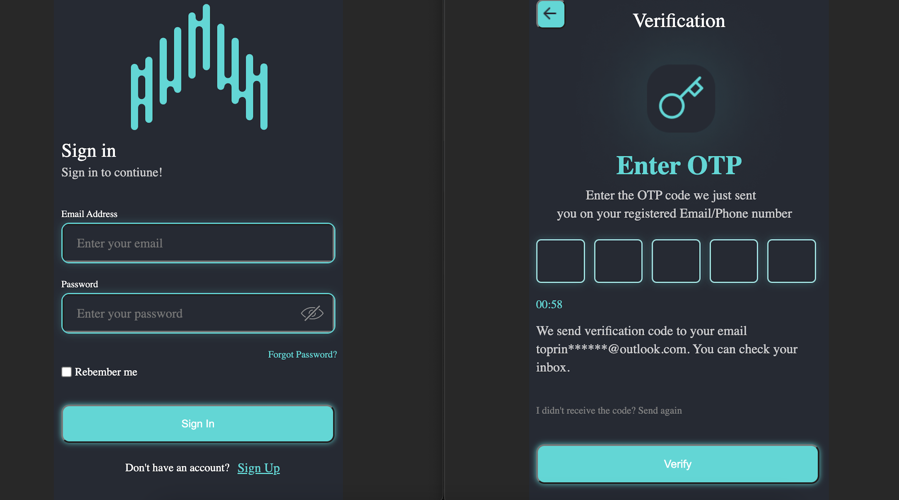
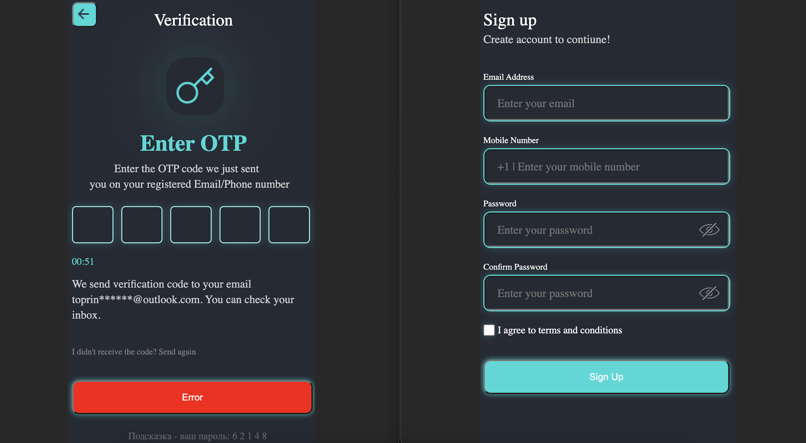

# Вход в приложение!

 

Если вы не зарегистрированный пользователь, нажмите на Sign Up  и создайте учетную запись. А если у вас есть личный кабинет, то необходимо ввести почту и палоль, далее мы переходим в раздел верификации.

Воодим пароль подтверждения. Пятизначный пароль введн правильный, то мы заходим в приложение. Если ввод не правильный по истечению времени можно запросить новый пароль.

Есть и парочку вспомогательных вещей. Нажав на "глазик" в поле ввода, можно увидить цифры, которые вы вписали. На странице верификации, под кнопкой, может появится подсказка с правельным паролем

